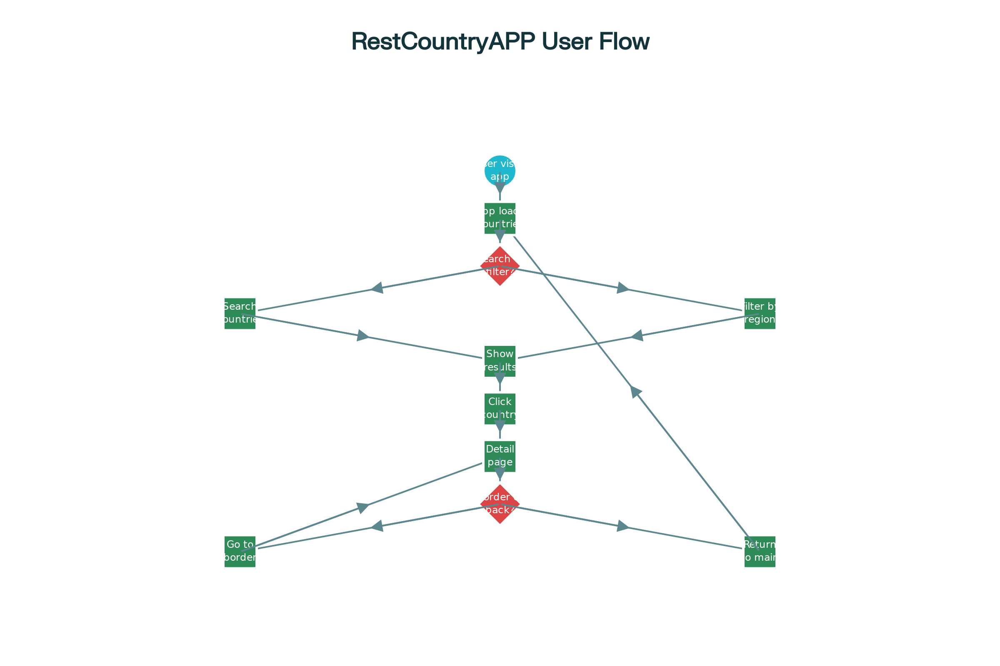

# RestCountryAPP - Complete Developer Guide

A comprehensive React application that displays detailed information about countries worldwide using static country data. This app features search functionality, region filtering, detailed country views, and a responsive design with dark/light mode support.

## 🌟 Live Demo

**[View Live Application](https://nationpalette.netlify.app/)**

***

## 📋 Table of Contents

- [Repository Basics](#-repository-basics)
- [Features](#-features)
- [Technologies Used](#-technologies-used)
- [Directory Structure](#-directory--file-structure)
- [Code Understanding](#-code-understanding)
- [Setup \& Installation](#-setup--installation)
- [Application Architecture](#-application-architecture)
- [User Flow](#-user-flow)
- [Data Structure](#-data-structure)
- [Usage Examples](#-usage-examples)
- [Contributing](#-contributing)
- [Troubleshooting](#-troubleshooting)

***

## 🚀 Repository Basics


### Purpose \& Overview

This React application serves as a comprehensive country information portal that allows users to explore detailed data about all world countries. The app provides an intuitive interface for searching, filtering, and viewing country-specific information including demographics, geography, currencies, languages, and neighboring countries.[^1][^2][^3]




**Key Capabilities:**

- **Search Functionality**: Find countries by name (common or official names)[^4]
- **Regional Filtering**: Filter countries by continent (Africa, Americas, Asia, Europe, Oceania)[^4]
- **Detailed Views**: Navigate to individual country pages with comprehensive data[^4]
- **Border Navigation**: Click on border countries to explore neighboring nations[^4]
- **Theme Support**: Toggle between light and dark modes[^4]
- **Responsive Design**: Optimized for all device sizes[^4]


### Prerequisites

Before setting up this project, ensure you have the following installed:

- **Node.js**: Version 14.x or higher[^5]
- **npm**: Version 6.x or higher[^5]
- **Git**: For repository management
- **Code Editor**: VS Code, Sublime Text, or similar


### Cloning \& Setup Instructions

#### For Windows:

```bash
# Clone the repository
git clone https://github.com/RAJAN-115/RestCountryAPP.git

# Navigate to project directory
cd RestCountryAPP

# Install dependencies
npm install

# Start development server
npm start
```


#### For macOS/Linux:

```bash
# Clone the repository
git clone https://github.com/RAJAN-115/RestCountryAPP.git

# Navigate to project directory  
cd RestCountryAPP

# Install dependencies
npm install

# Start development server
npm start
```


***

## ✨ Features

- 🌍 **Comprehensive Country Database**: Access information for all world countries
- 🔍 **Smart Search**: Search by country name with real-time filtering
- 🌎 **Region Filtering**: Filter countries by geographic regions
- 📱 **Responsive Design**: Works seamlessly on desktop, tablet, and mobile
- 🌙 **Dark/Light Mode**: Toggle between themes for better user experience
- 🗺️ **Interactive Navigation**: Click country cards to view detailed information
- 🔗 **Border Country Links**: Navigate between neighboring countries
- ⚡ **Fast Performance**: Static data loading for quick response times

***

## 🛠 Technologies Used

- **Frontend Framework**: React 18.2.0[^1]
- **Routing**: React Router DOM 6.10.0[^1]
- **Bundler**: Parcel 2.8.3[^1]
- **Styling**: Pure CSS with CSS Custom Properties[^6]
- **Data Source**: Static JSON data (REST Countries API format)[^7]
- **Deployment**: Netlify[^4]

***

## 📁 Directory \& File Structure

```
RestCountryAPP/
├── 📁 .parcel-cache/          # Parcel build cache
├── 📁 components/             # React components
│   ├── CountriesList.jsx      # Main countries list container[^10]
│   ├── CountryCard.jsx        # Individual country card[^11]
│   ├── CountryDetail.jsx      # Detailed country view[^12]
│   ├── Header.jsx             # App header with theme toggle[^8]
│   ├── SearchBar.jsx          # Search input component[^13]
│   └── SelectMenu.jsx         # Region filter dropdown[^14]
├── 📁 dist/                   # Production build output
├── 📁 node_modules/           # Dependencies
├── 📄 .gitignore              # Git ignore rules
├── 📄 App.css                 # Main stylesheet[^15]
├── 📄 App.jsx                 # Root application component[^4]
├── 📄 CONTRIBUTING.md         # Contribution guidelines
├── 📄 countriesData.js        # Static country data[^7]
├── 📄 index.html              # HTML entry point[^5]
├── 📄 index.jsx               # React entry point[^6]
├── 📄 INSTALLATION.md         # Setup instructions[^9]
├── 📄 netlify.toml            # Netlify deployment config
├── 📄 package.json            # Project dependencies[^2]
├── 📄 package-lock.json       # Dependency lock file
├── 📄 PREVIEW.md              # App screenshots
├── 📄 README.md               # This documentation
└── 📄 _redirects              # Netlify routing rules
```


### Key File Descriptions

| File | Purpose | Key Features |
| :-- | :-- | :-- |
| **App.jsx** | Main application component | State management, routing, filtering logic[^4] |
| **countriesData.js** | Static data source | Contains 23,956 lines of country data[^7] |
| **App.css** | Styling system | CSS variables, responsive design, theming[^6] |
| **index.html** | Entry HTML file | Root element, meta tags[^8] |
| **package.json** | Dependencies config | Scripts, dependencies, metadata[^1] |


***

## 🧠 Code Understanding

### Application Entry Points

#### 1. HTML Entry Point (`index.html`)[^8]

```html
<!DOCTYPE html>
<html lang="en">
<head>
    <meta charset="UTF-8">
    <meta name="viewport" content="width=device-width, initial-scale=1.0">
    <title>Countries API</title>
</head>
<body>
    <div id="root"></div>
    <script type="module" src="index.jsx"></script>
</body>
</html>
```


#### 2. React Entry Point (`index.jsx`)[^9]

```javascript
import {createRoot} from 'react-dom/client'
import App from './App'

const root = createRoot(document.querySelector('#root'))
root.render(<App />)
```


### Core Application Logic (`App.jsx`)[^4]

The main App component manages the application's state and routing:

```javascript
const App = () => {
  const [countries, setCountries] = useState(countriesData);
  const [searchTerm, setSearchTerm] = useState('');
  const [selectedRegion, setSelectedRegion] = useState('');
  const [isDarkMode, setIsDarkMode] = useState(false);
  
  // Filtering logic
  useEffect(() => {
    let filteredCountries = countriesData;
    
    if (searchTerm.trim()) {
      const searchLower = searchTerm.trim().toLowerCase();
      filteredCountries = filteredCountries.filter(
        country =>
          country.name.common.toLowerCase().includes(searchLower) ||
          country.name.official.toLowerCase().includes(searchLower)
      );
    }
    
    if (selectedRegion) {
      filteredCountries = filteredCountries.filter(
        country => country.region === selectedRegion
      );
    }
    
    setCountries(filteredCountries);
  }, [searchTerm, selectedRegion]);
```


### Component Breakdown

#### Header Component (`Header.jsx`)[^10]

- Displays app title and theme toggle button
- Manages dark/light mode switching
- Clean, responsive header design


#### Search \& Filter Components

- **SearchBar.jsx**: Real-time country name search[^11]
- **SelectMenu.jsx**: Region-based filtering with preset options[^12]


#### Display Components

- **CountriesList.jsx**: Maps through filtered countries array[^13]
- **CountryCard.jsx**: Individual country preview cards with navigation[^14]
- **CountryDetail.jsx**: Comprehensive country information page[^15]


### Data Flow Architecture

1. **Static Data Loading**: `countriesData.js` contains pre-loaded country information[^7]
2. **State Management**: App.jsx manages search, filter, and theme states[^4]
3. **Component Communication**: Props passed down for data and callbacks up for actions
4. **Routing**: React Router handles navigation between list and detail views[^4]

### Styling System (`App.css`)[^6]

The application uses a sophisticated CSS system with:

- **CSS Custom Properties**: Dynamic theming support

```css
body {
  --background-color: white;
  --text-color: black;
  --elements-color: white;
}

body.dark {
  --background-color: hsl(207, 26%, 17%);
  --text-color: white;
  --elements-color: hsl(209, 23%, 22%);
}
```

- **Responsive Design**: Mobile-first approach with media queries
- **Component-Specific Styles**: Organized CSS classes for each component
- **Smooth Transitions**: Hover effects and animations

***

## 📦 Setup \& Installation

### Step-by-Step Installation Guide

#### 1. Clone Repository

```bash
git clone https://github.com/RAJAN-115/RestCountryAPP.git
cd RestCountryAPP
```


#### 2. Install Dependencies[^5]

```bash
npm install
```

This installs:

- React 18.2.0 and React DOM[^1]
- React Router DOM 6.10.0[^1]
- Parcel 2.8.3 bundler[^1]
- Process polyfill[^1]


#### 3. Start Development Server[^5]

```bash
npm start
```

Application runs at: `http://localhost:1234`

#### 4. Build for Production[^5]

```bash
npm run build
```

Creates optimized build in `dist/` folder

### Environment Configuration

No environment variables required - the app uses static data for optimal performance.

### Running Tests

Currently no test suite is configured. Consider adding:

- Jest for unit testing
- React Testing Library for component testing
- Cypress for end-to-end testing

***

## 🏗 Application Architecture

### Architectural Patterns

#### 1. Component-Based Architecture[^16]

- **Modular Design**: Each component has a single responsibility
- **Reusability**: Components can be easily reused and extended
- **Maintainability**: Clear separation of concerns


#### 2. Container-Component Pattern[^17]

- **Smart Components**: App.jsx manages state and logic
- **Dumb Components**: UI components receive props and render


#### 3. Static Data Architecture

- **Performance**: Pre-loaded data eliminates API calls
- **Reliability**: No network dependencies
- **Speed**: Instant search and filtering


### Data Flow Sequence

1. **Application Initialization**
    - `index.jsx` renders `App.jsx`
    - `countriesData.js` loads static data
    - Initial state set with all countries
2. **User Interaction Handling**
    - Search input triggers `handleSearchChange`
    - Region selection triggers `handleRegionChange`
    - Filter effects update displayed countries
3. **Navigation Flow**
    - Country card click navigates to detail route
    - React Router handles URL changes
    - Detail page loads specific country data

***

## 🎯 User Flow

### Primary User Journeys

#### 1. Country Discovery Flow

1. User visits homepage
2. Views all countries in card layout
3. Uses search or region filter
4. Clicks country card for details
5. Explores related countries via borders

#### 2. Search \& Filter Flow

1. User enters search term
2. Real-time filtering displays results
3. Can combine search with region filter
4. Results update instantly

#### 3. Country Detail Exploration

1. Click country card
2. View comprehensive country data
3. Click border countries to explore neighbors
4. Use back button to return to main view

***

## 📊 Data Structure

### Country Object Schema[^3][^18]

The application uses the REST Countries API data format:

```javascript
{
  "name": {
    "common": "United States",
    "official": "United States of America"
  },
  "flags": {
    "svg": "https://flagcdn.com/us.svg",
    "png": "https://flagcdn.com/w320/us.png"
  },
  "population": 329484123,
  "region": "Americas",
  "subregion": "North America", 
  "capital": ["Washington, D.C."],
  "currencies": {
    "USD": {
      "name": "United States dollar",
      "symbol": "$"
    }
  },
  "languages": {
    "eng": "English"
  },
  "borders": ["CAN", "MEX"],
  "tld": [".us"],
  "cca3": "USA"
}
```


### Key Data Properties

| Property | Type | Description | Usage |
| :-- | :-- | :-- | :-- |
| `name.common` | String | Common country name | Display, search |
| `name.official` | String | Official country name | Search, detail view |
| `flags.svg` | String | SVG flag URL | Country cards, details |
| `population` | Number | Population count | Demographics display |
| `region` | String | Geographic region | Filtering |
| `borders` | Array | Border country codes | Navigation links |
| `currencies` | Object | Currency information | Economic data |
| `languages` | Object | Spoken languages | Cultural information |


***

## 💡 Usage Examples

### Searching for Countries

```javascript
// Search functionality in action
const handleSearchChange = (value) => {
  setSearchTerm(value);
  // Triggers useEffect to filter countries
};
```


### Filtering by Region

```javascript  
// Region filtering implementation
const handleRegionChange = (value) => {
  setSelectedRegion(value);
  // Updates displayed countries list
};
```


### Navigation Between Countries

```javascript
// Country card navigation
const handleClick = () => {
  navigate(`/country/${encodeURIComponent(name)}`);
};
```


### Theme Switching

```javascript
// Dark/light mode toggle
const toggleDarkMode = () => {
  setIsDarkMode(!isDarkMode);
  // Updates CSS custom properties
};
```


***

## 🤝 Contributing

### Development Workflow

#### 1. Fork \& Clone

```bash
git clone https://github.com/YOUR-USERNAME/RestCountryAPP.git
cd RestCountryAPP
```


#### 2. Create Feature Branch

```bash
git checkout -b feature/new-feature-name
```


#### 3. Make Changes

- Follow existing code patterns
- Update documentation if needed
- Test thoroughly


#### 4. Submit Pull Request

- Describe changes clearly
- Include screenshots for UI changes
- Reference any related issues


### Code Style Guidelines

#### React Component Structure

```javascript
import React from 'react';

export default function ComponentName({ props }) {
  // Component logic here
  
  return (
    <div className="component-class">
      {/* JSX content */}
    </div>
  );
}
```


#### CSS Naming Convention

```css
.component-name {
  /* Component base styles */
}

.component-name__element {
  /* Element-specific styles */
}

.component-name--modifier {
  /* Modifier styles */
}
```


### Potential Improvements

- **API Integration**: Connect to live REST Countries API[^3][^18]
- **Testing Suite**: Add Jest and React Testing Library
- **Performance**: Implement virtualization for large lists
- **Accessibility**: Enhanced ARIA labels and keyboard navigation
- **Features**: Add favorites, comparison tool, maps integration
- **PWA**: Add service worker for offline functionality

***

## 🛠 Troubleshooting

### Common Issues \& Solutions

#### 1. Installation Problems[^5]

**React Router Version Issues**:

```bash
npm uninstall react-router-dom
npm install react-router-dom@6.10.0
```

**Parcel Cache Issues**:

```bash
npm cache clean --force
rm -rf .parcel-cache  # Linux/macOS
rmdir /s /q .parcel-cache  # Windows
npm start
```


#### 2. Runtime Issues

**Countries Not Displaying**:

- Check if `countriesData.js` is properly imported
- Verify data structure matches expected format
- Check browser console for JavaScript errors

**Search Not Working**:

- Ensure search term state is updating
- Check filter logic in `useEffect`
- Verify case-insensitive comparison

**Navigation Issues**:

- Check React Router setup
- Verify route paths match navigation calls
- Ensure `encodeURIComponent` is used for country names


#### 3. Styling Problems

**Theme Not Switching**:

- Check if CSS custom properties are defined
- Verify `isDarkMode` state updates
- Ensure body class toggle works

**Responsive Issues**:

- Test media query breakpoints
- Check viewport meta tag
- Verify flexible layout properties


### Browser Compatibility[^5]

**Supported Browsers**:

- Chrome (latest)
- Firefox (latest)
- Safari (latest)
- Edge (latest)

**Minimum Requirements**:

- ES6+ support
- CSS Custom Properties
- Fetch API (or polyfill)

***

## 📈 Performance Considerations

### Optimization Strategies

- **Static Data**: Eliminates network requests for faster loading
- **Component Memoization**: Consider `React.memo` for expensive components
- **Virtual Scrolling**: For handling large country lists
- **Image Optimization**: Lazy loading for flag images
- **Bundle Splitting**: Code splitting for better loading performance


### Deployment

The application is deployed on Netlify with the following configuration:

- **Build Command**: `npm run build`
- **Publish Directory**: `dist`
- **Redirects**: SPA routing handled via `_redirects` file

***

## 📄 License

This project is open source and available under the [MIT License](LICENSE).

***

## 🙏 Acknowledgments

- **REST Countries API**: For providing comprehensive country data[^2][^3]
- **React Community**: For excellent documentation and tools
- **Netlify**: For free hosting and deployment
- **Flag Icons**: Country flag resources

***

*Last Updated: August 2025*

**Repository**: [github.com/RAJAN-115/RestCountryAPP](https://github.com/RAJAN-115/RestCountryAPP)
**Live Demo**: [nationpalette.netlify.app](https://nationpalette.netlify.app/)

<div style="text-align: center">⁂</div>

[^1]: https://github.com/RAJAN-115/RestCountryAPP/blob/main/package.json

[^2]: https://restcountries.com

[^3]: https://publicapi.dev/rest-countries-api

[^4]: https://github.com/RAJAN-115/RestCountryAPP/blob/main/App.jsx

[^5]: https://github.com/RAJAN-115/RestCountryAPP/blob/main/INSTALLATION.md

[^6]: https://github.com/RAJAN-115/RestCountryAPP/blob/main/App.css

[^7]: https://github.com/RAJAN-115/RestCountryAPP/blob/main/countriesData.js

[^8]: https://github.com/RAJAN-115/RestCountryAPP/blob/main/index.html

[^9]: https://github.com/RAJAN-115/RestCountryAPP/blob/main/index.jsx

[^10]: https://github.com/RAJAN-115/RestCountryAPP/blob/main/components/Header.jsx

[^11]: https://github.com/RAJAN-115/RestCountryAPP/blob/main/components/SearchBar.jsx

[^12]: https://github.com/RAJAN-115/RestCountryAPP/blob/main/components/SelectMenu.jsx

[^13]: https://github.com/RAJAN-115/RestCountryAPP/blob/main/components/CountriesList.jsx

[^14]: https://github.com/RAJAN-115/RestCountryAPP/blob/main/components/CountryCard.jsx

[^15]: https://github.com/RAJAN-115/RestCountryAPP/blob/main/components/CountryDetail.jsx

[^16]: https://www.upgrad.com/blog/react-js-architecture/

[^17]: https://www.imensosoftware.com/blog/scaling-react-js-applications-architectural-patterns-and-performance-optimization/

[^18]: https://github.com/apilayer/restcountries

[^19]: https://github.com/RAJAN-115/RestCountryAPP

[^20]: https://github.com/RAJAN-115/RestCountryAPP/tree/main/components

[^21]: https://documenter.getpostman.com/view/1134062/T1LJjU52

[^22]: https://www.isolutions-sa.com/custom-connectors/rest-countries-api/

[^23]: https://zylalabs.com/api-marketplace/tools/countries+data+api/2656

[^24]: https://www.youtube.com/watch?v=rFIHjT2whZM

[^25]: https://publicapis.io/rest-countries-api

[^26]: https://apyhub.com/utility/data-info-country

[^27]: https://code-b.dev/blog/react-design-patterns

[^28]: https://www.youtube.com/watch?v=u-_uGO95xco

[^29]: https://www.apicountries.com

[^30]: https://github.com/dr5hn/countries-states-cities-database

[^31]: https://www.prismetric.com/react-design-patterns/

[^32]: https://www.youtube.com/watch?v=o1gU1RpBMi4

